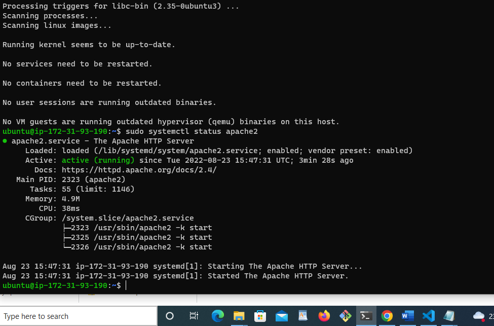
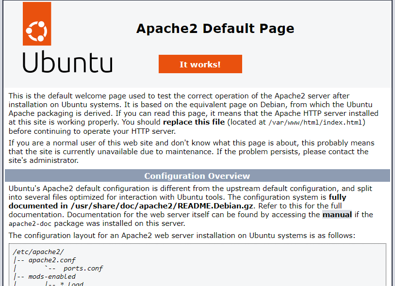
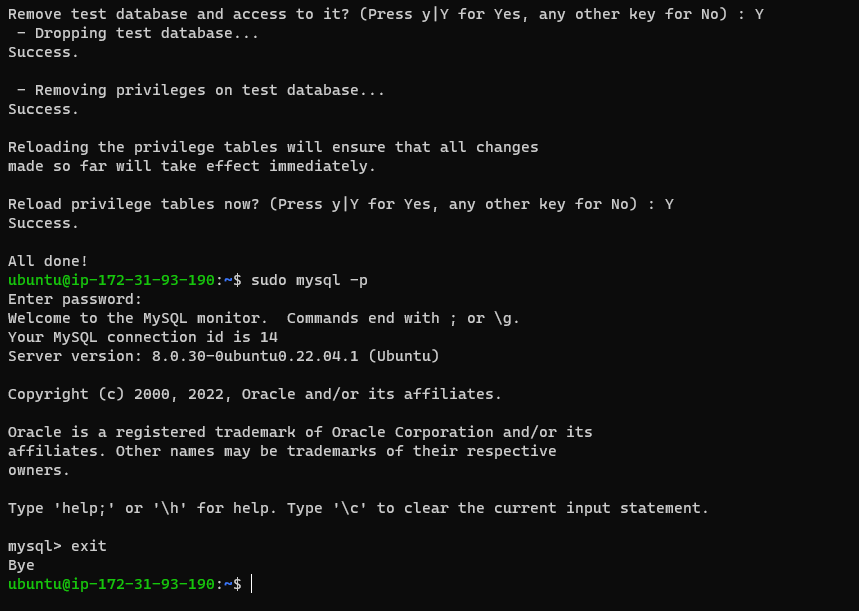
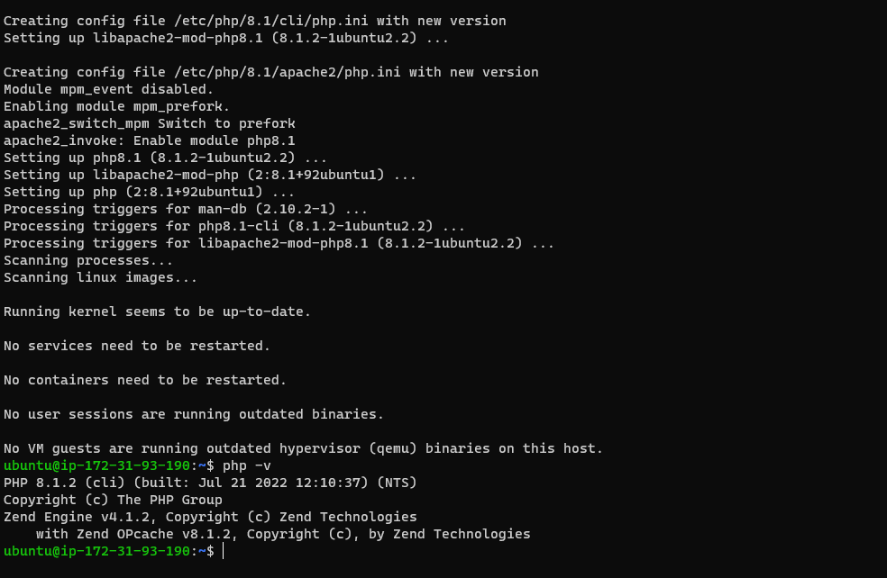
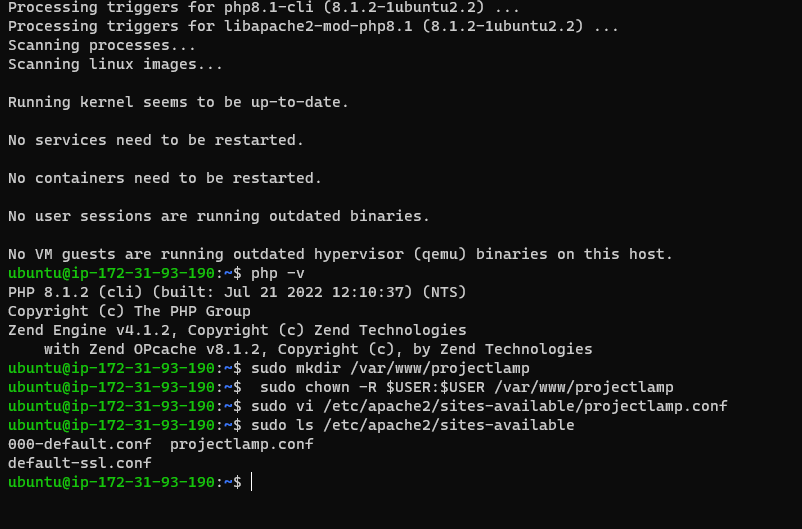
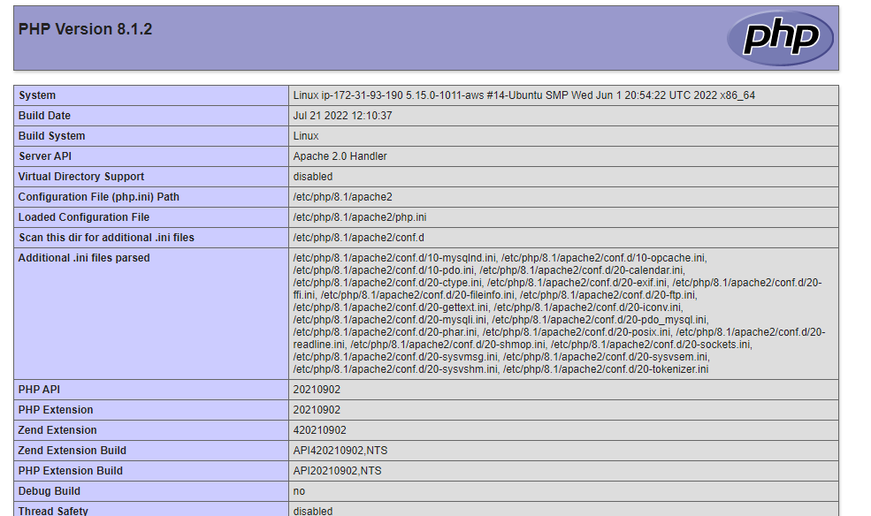

## LAMP IMPLEMENTATION DOCUMENTATION

`sudo apt install apache2`

`sudo systemctl status apache2`

`curl http://127.0.0.1:80`

`sudo apt install mysql-server`

`sudo mysql`

`sudo mysql -p`

`mysql> exit`

`sudo apt install php libapache2-mod-php php-mysql`

`php -v`

`sudo mkdir /var/www/projectlamp`

`sudo chown -R $USER:$USER /var/www/projectlamp`

`sudo vi /etc/apache2/sites-available/projectlamp.conf`

`sudo ls /etc/apache2/sites-available`

`sudo a2ensite projectlamp`

`sudo a2dissite 000-default`

`sudo apache2ctl configtest`

`sudo systemctl reload apache2`

`sudo echo 'Hello LAMP from hostname' $(curl -s http://169.254.169.254/latest/meta-data/public-hostname) 'with public IP' $(curl -s http://169.254.169.254/latest/meta-data/public-ipv4) > /var/www/projectlamp/index.html`

`sudo vim /etc/apache2/mods-enabled/dir.conf`

`sudo systemctl reload apache2`

`vim /var/www/projectlamp/index.php`

`sudo rm /var/www/projectlamp/index.php`

